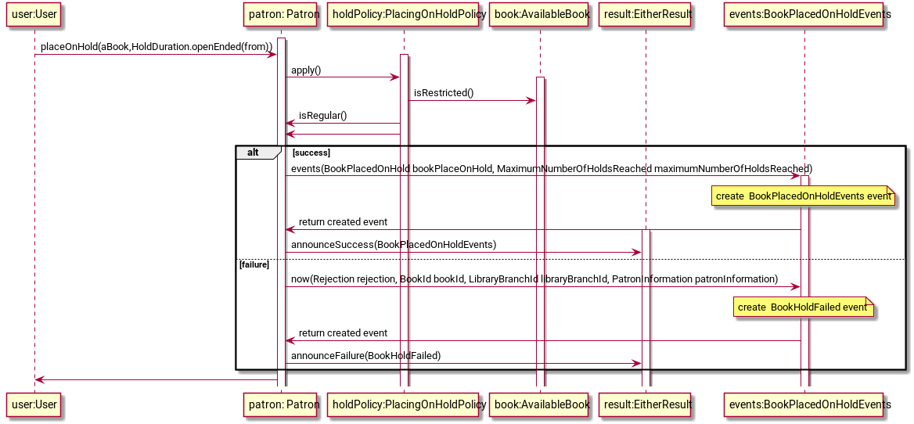

## Overviewin hexagonal architecture
This implementation based on a domain analysis carried out 
as part of the project https://github.com/ddd-by-examples/library .   

## [Domain Description](https://github.com/ddd-by-examples/library#domain-description) 

###General assumptions (interpretation)

1. Two main roles: Patron and Researcher Patron.
2. Access to some instances of books may be restricted (available only for researcher patrons) 
3. Available book can be placed on hold (reserved) only by one patron at any given point in time.
4. Regular patron is limited to five holds at any moment, researcher patron hasn't any limits.
5. There are two main types of book holding:
+ open-ended - is active until the patron checks out the book
+ close-ended - can be expired (if it's not completed within a fixed number of days)
6. There is a daily sheet with expiring holds (checks at the beginning day).
7. Resercher patron can request an open-ended hold duration.
8. Any patron with more than two overdue checkouts at library branch will get a hold rejection (in this branch).
9. Any book can be checked out for up to 60 days.
10. There is a daily sheet with overdue checkouts.
11. There is a patron profile. It is used to interact with current holds and checkouts. This is a form of daily sheet
with limitation to actual patron data, and without a daily dimension.
12. Patron can see current holds (not canceled nor expired), and current checkouts (including overdue).
13. Patron can hold a book, and cancel holds. 

## Modules


## Aggregates
There are two main aggregates:
1. Library catalogue - simple CRUD without business logic. 
2. Lending  - module with domain objects and business rules.

## Implementation

### Hold on book process


#### 

Book reservation business logic is realized by method Patron.placeOnHold()
  ```java
placeOnHold(AvailableBook aBook, HoldDuration holdDuration) {
        Option<Rejection> rejection = patronCanHold(aBook, holdDuration);
       ...
    }
   
   ```
Checking booking conditions is delegated to the method Patron.patronCanHold()
```java
private Option<Rejection> patronCanHold(AvailableBook aBook, HoldDuration holdDuration) {
        return placingOnHoldPolicies
                .toStream()
                .map(policy -> policy.apply(aBook, this, holdDuration))
                .find(Either::isLeft)
                .map(Either::getLeft)
                ;

    }
```
The lambda realizing business logic is defined in PlacingOnHoldPolicy interface.
This interface is a repository of different holding policies.
```java
 PlacingOnHoldPolicy onlyResearcherPatronsCanHoldRestrictedBooksPolicy =
            (AvailableBook book, Patron patron, HoldDuration holdDuration) -> {
                if (book.isRestricted() && patron.isRegular()) {
                    return left(Rejection.withReason("Regular patrons cannot hold restricted books"));
                }
                return right(new Allowance());
            };
```

Main goals of Patron.placeOnHold() method
* checking business logic
* creating BookPlacedOnHold event
* creating BookPlacedOnHoldEvents
* BookPlacedOnHoldEvents emission (on success or failure)
```java
public Either<BookHoldFailed, PatronEvent.BookPlacedOnHoldEvents>
placeOnHold(AvailableBook aBook, HoldDuration holdDuration) {
         Option<Rejection> rejection = patronCanHold(aBook, holdDuration);

        if (rejection.isEmpty()) {
            PatronEvent.BookPlacedOnHold bookPlacedOnHold = 
            PatronEvent.BookPlacedOnHold.bookPlacedOnHoldNow
                    (aBook.getBookId(), aBook.type(), aBook.getLibraryBranch(), patron.getPatronId(), holdDuration);

      ...
            return announceSuccess(events(bookPlacedOnHold));
        }    
...
return EitherResult.announceFailure(BookHoldFailed.now(rejection.get(), aBook.getBookId(), aBook.getLibraryBranch(), patron));
    }
   
   ```

The BookPlacedOnHoldEvents is created on a base of BookPlacedOnHold event.
Original BookPlacedOnHold event carries information about book holding. 
BookPlacedOnHoldEvents is a carrier of wider information f.e. "This was a last possible holding". 
This intention is expressed via Option<MaximumNumberOfHoldsReached> maximumNumberOfHoldsReached.
MaximuNumberOfHoldsReached is another event instantioned directly in placeOnHold() method. 
```java
class BookPlacedOnHoldEvents implements PatronEvent {
        UUID eventId = UUID.randomUUID();
        UUID patronId;
        BookPlacedOnHold bookPlacedOnHold;
        Option<MaximumNumberOfHoldsReached> maximumNumberOfHoldsReached;

        @Override
        public Instant getWhen() {
            return bookPlacedOnHold.getWhen();
        }

        public static BookPlacedOnHoldEvents events(BookPlacedOnHold bookPlacedOnHold) {
            return new BookPlacedOnHoldEvents(bookPlacedOnHold.getPatronId(), bookPlacedOnHold, Option.none());
        }
}
```
Original BookPlaceOnHoldEvent:

```java
class BookPlacedOnHold implements PatronEvent {
        UUID eventId = UUID.randomUUID();
        Instant when;
        UUID patronId;
        UUID bookId;
        BookType bookType;
        UUID libraryBranchId;
        Instant holdFrom;
        Instant holdTill;

        public static BookPlacedOnHold bookPlacedOnHoldNow(BookId bookId, BookType bookType,
                                                           LibraryBranchId libraryBranchId,
                                                           PatronId paronId,
                                                           HoldDuration holdDuration) {
                                                            ....
    }
}
```
Code of MaximumNumberOfHoldsReached event
```java
@Value
class MaximumNumberOfHoldsReached implements PatronEvent {
    UUID eventId = UUID.randomUUID();
    Instant when;
    UUID patronId;
    int numberOfHolds;

    public static MaximumNumberOfHoldsReached now(PatronInformation patronInformation, int numberOfHolds) {
        return new MaximumNumberOfHoldsReached(Instant.now(),
                patronInformation.getPatronId().getPatronId(),
                numberOfHolds);
    }
}

```

Instantioning MaximumNumberOfHoldsReached event from Patron.holdOn() method
```java
 if (patronHolds.maximumHoldsAfterHolding(aBook)) {
                return announceSuccess(events(bookPlacedOnHold, MaximumNumberOfHoldsReached.now(patron, MAX_NUMBER_OF_HOLDS)));
            }
```


Methods implementing business actions inform the environment about their success or failure.
It is done by using Either object. It should be treated like a Pair. 
Business method should return only one side of this pair.
By the conventions on success, the right side is returned, in case of failure, the left side.
EitherResult interface provides an abstraction on this action.

```java 
    public interface EitherResult {

    public static <L, R> Either<L, R> announceFailure(L left) {
        return left(left);
    }

    public static <L, R> Either<L, R> announceSuccess(R right) {
        return right(right);
    }
}
'''