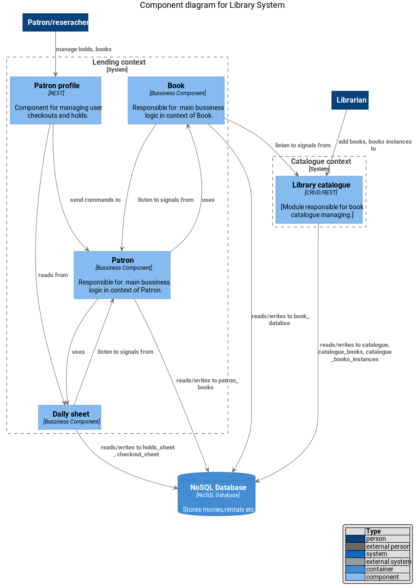

## Overviewin hexagonal architecture
This repo is an example of hexagonal multimodule architecture .
I try to use techniques connected with DDD, and Event Driven Architecture.

## Domain
We want to create DVD rental manegement system.
It should realize  the following functionalities:

1. DVD catalogue managing (employee should (add/remove/delete) movies from the catalogue).
2. Some of them can be marked as "special offer". Promoted  movies are rented for 
a longer period (x2) and at a special price (30%). The promotional offer is available only to VIP customers.
3. Every customer  can make a reservation two movies for 2 days (VIP for 5 days), after this time, reservations expired.
4. Reservation can be reject if the user has any video with a refund date exceeded. 
5. The rental price depends on type of the movie, and the number of bonus points owned by the user costs: regular movie(20), new movie (30), old movie (10)
6. Customer can post a review to movie. This is awarded with bonus points (5 points per review). 
7. Each rental results in a bonus point
8. When user reaches 100 points, he gets VIP status.
9. Customer can view status of their reservations and rentals
10. Employee may see all not returned movies (date of return is less than now )
11. Employee may send reminder information (via email)
12. System can calculate penalty interests for defaulting customers. 

## Acceptance integration test
  ``` java
 @DisplayName("Positive test acceptance - rental dvd movie")
    @Test
    void positiveRental()
            throws Exception {
        // given inventory with three films added
        // "Clerks" (type=old), "Frozen" (type="regular"), "Toy Story 4" (type=new)

        // when 'I go /films'
        // then 'I can see all 3 films'

        // when 'I go /points'
        // then 'I can see no points'

        //when 'I post /price with all movies for standard period 2 days'
        //then 'I can see: Clerks (price=10),Frozen(price=20), Toy Story 4 (price=30), Total=60 '

        //when 'I go /reservation'
        //then 'I can see empty list'

        //when 'I post /reservation with all movies for standard period 2 days'
        //then 'I have reserved all movies'

        //when 'I go /reservation'
        //then 'I can see three position list'

        //when 'I go /rental'
        //then 'I can see empty list'

        //when 'I post /rental with three films for standard 2 days'
        //then 'I rent three films'

        //when 'I go /rental'
        //then 'I can see three position list'

        //when 'I go /points'
        //then 'I can see 3 points'

        //when 'I go /review'
        //then 'I can see empty list'

        //when 'I post /review with my comment for Clerks'
        //then 'My review was added'

        //when 'I go /review'
        //then 'I can see list with one position'

        //when 'I go /points'
        //then 'I can see 8 points'
    }
  ```
## Modules
